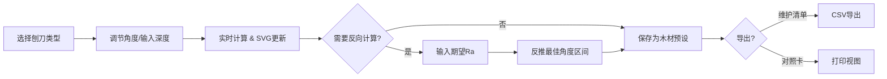

## 1. 产品概述

木工刨刀角度与切削深度计算器——面向木工匠人和家具制造从业者的纯前端专业计算工具。基于切削几何模型，根据刨刀类型、刀刃角度、刨削深度和木材硬度，精确计算切屑厚度、刨削力和理论表面粗糙度；支持反向推导最佳刨刀角度，帮助提升加工质量与刀具寿命。

- 核心价值：将经验性的木工刨削工艺转化为可量化、可复现的科学参数
- 目标用户：专业木工匠人、家具设计师、木工爱好者、职业院校师生

## 2. 核心功能

### 2.1 功能模块

1. **参数输入面板**：刨刀类型选择、刀刃角度滑块、刨削深度输入、木材硬度选择
2. **刨刀示意图**：SVG 动态绘制刨刀切削截面，随参数实时更新角度与深度标注
3. **正向计算引擎**：输出切屑厚度、刨削力、表面粗糙度等关键指标
4. **反向计算模式**：输入期望表面粗糙度/切屑厚度，反推最佳刀刃角度范围
5. **参数预设库**：保存不同木材的刨削参数到 localStorage，支持加载/删除
6. **维护清单导出**：导出 CSV/文本格式的刨刀维护清单（刃磨角度、适用木材、下次刃磨时间等）
7. **角度对照卡打印**：生成可打印的常用木材-角度对照表，适合车间张贴

### 2.2 页面详情

| 页面名称 | 模块名称 | 功能描述 |
|-----------|-------------|---------------------|
| 主界面（单页应用） | 刨刀类型选择器 | 平刨/压刨/槽刨/边刨/鸟刨切换，每种类型有默认角度范围 |
| | 角度调节滑块 | 15°-60° 范围调节，实时显示当前角度值，带刻度 |
| | 切削参数输入 | 刨削深度（0.1-5mm）、木材硬度（软/中/硬/极硬）下拉选择 |
| | 刨刀示意图 | SVG 截面图，动态显示楔角、切削角、切屑厚度标注 |
| | 计算结果面板 | 切屑厚度 h、刨削力 F、理论粗糙度 Ra，以卡片+进度条展示 |
| | 反向计算区 | 切换开关，输入期望 Ra 值，自动计算推荐角度区间 |
| | 预设管理区 | 保存当前参数为木材预设、加载已有预设、删除预设 |
| | 工具栏 | 导出维护清单、打印角度对照卡 |

## 3. 核心流程

用户选择刨刀类型 → 调节角度或输入深度 → 实时查看示意图与计算结果 → 切换反向模式输入期望质量 → 获得推荐参数 → 保存为木材预设 → 导出维护清单或打印对照卡

## 4. 用户界面设计

### 4.1 设计风格

**工业/工匠风格**——灵感源自传统木工坊与现代精密机床的融合：
- 主色：深胡桃木棕 `#5D4037`、铁匠灰 `#37474F`、铜金强调色 `#B8860B`
- 背景：米白卡纸质感 `#FAF6F0`，带细腻木纹噪点纹理
- 按钮：方中带圆角（4px），实体阴影，按下微凹陷，铜金描边
- 字体：标题用带衬线的专业感字体 "Playfair Display"；正文用清晰易读的 "Noto Serif SC"
- 图标：线面结合的工业风 SVG 图标，铜金描边

### 4.2 页面设计概览

| 页面名称 | 模块名称 | UI 元素 |
|-----------|-------------|-------------|
| 主界面 | 顶部标题栏 | 大号衬线字体标题 + 副标题，左侧刨刀 SVG logo，右侧工具栏按钮 |
| | 左栏 - 参数输入 | 卡片式分组：刨刀类型标签页、角度滑块（带刻度条）、数字输入框带步进按钮、木材硬度分段选择器 |
| | 中栏 - 刨刀示意图 | 深色背景 SVG 画布，金色描边刨刀截面，角度/深度用引导线标注，参数变化时有平滑过渡动画 |
| | 右栏 - 计算结果 | 三个指标卡片（切屑厚度/刨削力/粗糙度），数值大号显示+单位，下方彩色进度条显示"优/良/中/差"等级 |
| | 底部 - 预设与工具 | 预设列表横向滚动卡片，每个卡片可点击加载/删除；工具栏两个按钮：导出清单、打印对照卡 |

### 4.3 响应式

桌面端优先（三栏布局），中屏折叠为两栏（参数+示意图在上，结果在下），移动端单栏垂直堆叠，触摸滑块增大触控区域。

### 4.4 动效设计

- 页面加载：标题淡入上移，各卡片按顺序从下方滑入（staggered 50ms）
- 参数调节：SVG 角度线平滑旋转（0.2s ease），数值变化用数字滚动动画
- 保存预设：成功时卡片闪光高亮
- 悬停：按钮上浮 2px，阴影加深
