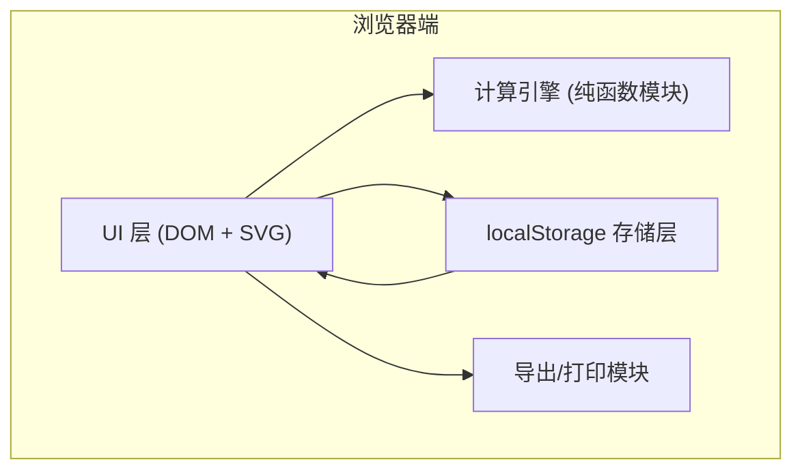

## 1. 架构设计



纯前端单页应用，无后端依赖。采用模块化原生 JavaScript，无需任何框架或构建工具。

## 2. 技术说明

- **前端**：原生 HTML5 + CSS3 + Vanilla JavaScript (ES6+)
- **图形**：内联 SVG，通过 JS 动态更新 path 与 text 元素
- **数据存储**：localStorage（key: `woodPlanerPresets`）
- **导出格式**：CSV（维护清单） + window.print()（角度对照卡）
- **本地服务**：Python3 http.server（端口 9201），纯静态文件服务
- **字体**：Google Fonts CDN（Playfair Display + Noto Serif SC）

## 3. 文件结构

```
/
├── index.html          # 主页面结构
├── styles.css          # 全部样式（CSS变量、布局、动画、打印样式）
├── app.js              # 主应用逻辑（计算引擎、UI绑定、存储、导出）
└── .trae/
    └── documents/
        ├── prd.md
        └── tech-arch.md
```

## 4. 计算模型

### 4.1 正向计算公式

| 参数 | 符号 | 公式 | 说明 |
|------|------|------|------|
| 切屑厚度 | h | `h = d × sin(α)` | d=刨削深度, α=刀刃楔角(弧度) |
| 刨削力 | F | `F = K × h × b / sin(α)` | K=木材切削比阻力, b=刨刀宽度(默认40mm) |
| 理论粗糙度 | Ra | `Ra = d / (8 × tan(α))` | 基于刀尖圆弧的近似模型 |

### 4.2 木材切削比阻力 K (N/mm²)

| 硬度等级 | 代表木材 | K 值 |
|----------|----------|------|
| 软木 | 松木、杨木、杉木 | 2.0 |
| 中硬木 | 橡木、榉木、樱桃 | 4.5 |
| 硬木 | 水曲柳、胡桃木 | 7.0 |
| 极硬木 | 紫檀、酸枝、黄花梨 | 10.0 |

### 4.3 刨刀类型默认参数

| 类型 | 推荐角度范围 | 用途描述 |
|------|-------------|----------|
| 平刨 | 25°-35° | 平面精加工 |
| 压刨 | 28°-38° | 厚度刨削 |
| 槽刨 | 30°-45° | 开槽成型 |
| 边刨 | 20°-30° | 边缘修整 |
| 鸟刨 | 22°-32° | 曲面成型 |

### 4.4 反向计算

输入期望 Ra 值 → 求解 α 满足 `Ra ≤ d / (8 × tan(α))` → 结合刨刀类型合理区间输出推荐角度范围。

## 5. 数据模型

### 5.1 localStorage 数据结构

```javascript
// key: woodPlanerPresets
[
  {
    id: "uuid",
    name: "红橡木精加工",
    planerType: "flat",
    bladeAngle: 30,
    cutDepth: 0.8,
    woodHardness: "medium",
    woodName: "红橡木",
    createdAt: 1717640000000,
    note: "桌面面板精刨"
  }
]
```

### 5.2 维护清单导出字段

预设名称、刨刀类型、刃磨角度、木材名称、硬度等级、刨削深度、切屑厚度、建议刃磨周期、备注

## 6. 打印样式

通过 `@media print` 隐藏交互元素，仅保留角度对照卡表格（木材种类 × 刨刀类型 × 推荐角度区间），A4 纸横排，黑白打印友好。
